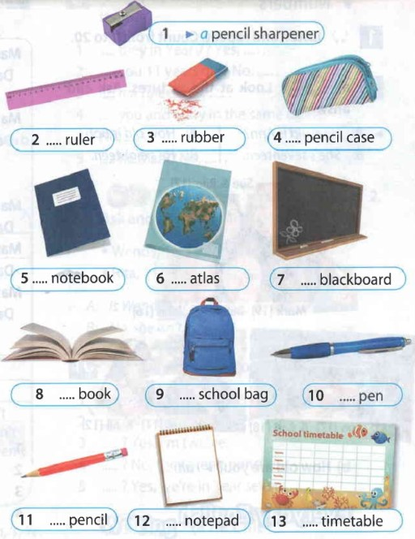

title: Lesson 1a
description: School!
tag: Module 1
about: School days

##School
&nbsp;

[Конспект урока](https://docs.google.com/document/d/1GE11m9JygT1rzaMFCAuwh-CqXNk7UYBS/edit?usp=drive_link&ouid=110561658400519864745&rtpof=true&sd=true)

&nbsp;

Task 1. Watch the video and answer the question: *What is the topic of our lesson?*

&nbsp;
Task 2. Choose the subjects you have at school

&nbsp;
Task 3. Match the names of subjects with pictures.
<iframe src="https://learningapps.org/watch?app=17463603" style="border:0px;width:100%;height:500px" allowfullscreen="true" webkitallowfullscreen="true" mozallowfullscreen="true"></iframe>

&nbsp;
Task 4. Match the days of week.
<iframe style="max-width:100%" src="https://wordwall.net/ru/embed/a43c167068774d2fadf1363dc24da175?themeId=45&templateId=3&fontStackId=0" width="800" height="380" frameborder="0" allowfullscreen></iframe>

&nbsp;
Task 5. Look at the timetable and write 5 sentences about it. Use different subjects and days.

**Kim has Math on Monday at nine o'clock.**

&nbsp;
Task 6. Look at the notices. Which are from teachers? Which are from students?

&nbsp;
Task 7. Put **a** or **an**

&nbsp;
Task 8. **Time for group project!**
Create your perfect timetable for the week.

&nbsp;
