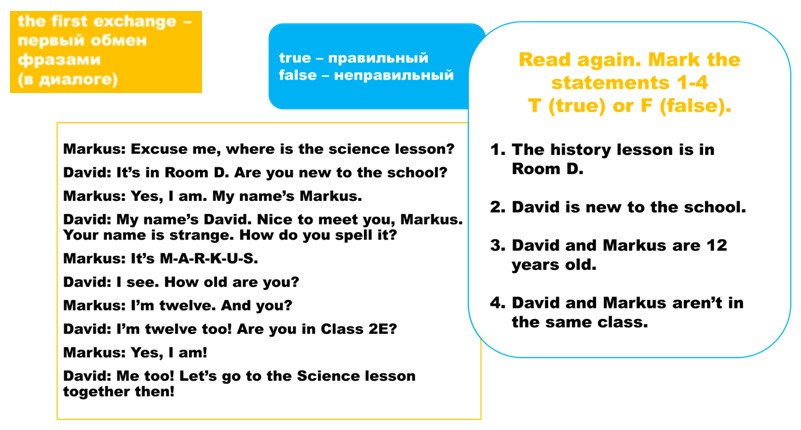

title: Lesson 1b
description: First day
tag: Module 1
about: School days

##First Day

[Конспект урока](https://docs.google.com/document/d/1Va4PbZLwtP_r-dYvjFPp1fDw-OfdvXqL/edit?usp=drive_link&ouid=110561658400519864745&rtpof=true&sd=true)

Task 1. Watch the video and answer the question:
*"What is the topic of their dialogue?"*
<iframe src="https://en.islcollective.com/english-esl-video-lessons/embed/361913" width="800" height="600" frameborder="0" allowfullscreen="" style="max-width: inherit !important; max-height: inherit !important;"></iframe>

Task2. Remember the subjects and days of week. Translate from Russian into English
<iframe style="max-width:100%" src="https://wordwall.net/ru/embed/ecc5f3e89d97427ba62f286d5c46e493?themeId=41&templateId=76&fontStackId=0" width="500" height="380" frameborder="0" allowfullscreen></iframe>

Task 3. Match numbers.
<iframe src="https://learningapps.org/watch?app=1229790" style=border="0px" width="800" height= "500px" allowfullscreen="true" webkitallowfullscreen="true" mozallowfullscreen="true"></iframe>

Task 4. Can you count the school objects?

__The first exchange - первый обмен фразами в диалоге (чаще всего привествие, короткое знакомство)__

Task 5. Talk about age

Task 6. Read the dialogue and answer the question:
*Where are two boys?"*

Task 7. Act the dialogue with your partner

**Personal pronouns**

Task 8. Fill the gaps
<iframe style="max-width:100%" src="https://wordwall.net/ru/embed/9462d0ad512a4249b6422344269a7d5b?themeId=48&templateId=5&fontStackId=0" width="500" height="380" frameborder="0" allowfullscreen></iframe>

Task 9. Answer the questions
<iframe style="max-width:100%" src="https://wordwall.net/ru/embed/0d8b551f0c3040fab98737dd867b8de2?themeId=42&templateId=70&fontStackId=0" width="500" height="380" frameborder="0" allowfullscreen></iframe>

Task 10. **Time for project.** Make a fact file about yourself, as in the example.

You should use this site:

