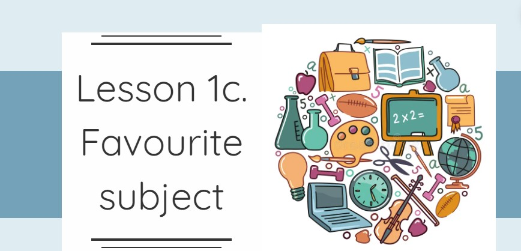
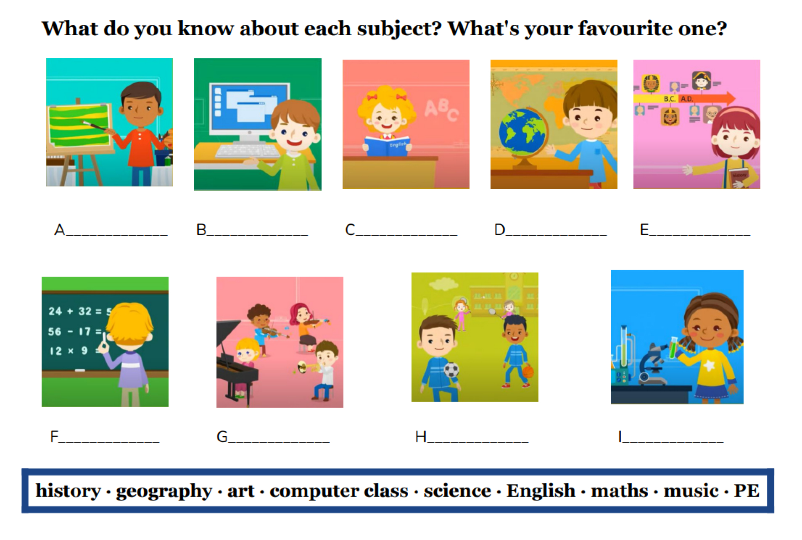
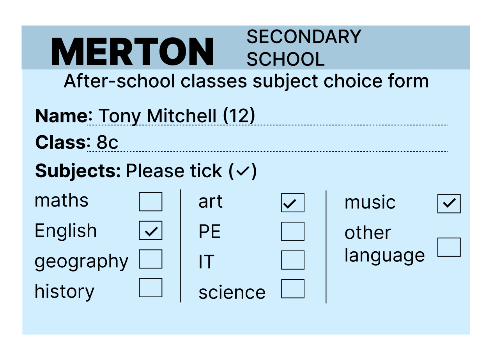
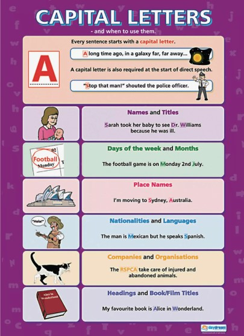

title: Lesson 1c
description: Favourite Subject
tag: Module 1
about: School days

##Favourite Subject

[Конспект урока](https://docs.google.com/document/d/1ZjF0sQobxqHubwNLX4PQBvA56JUiwnj1/edit?usp=drive_link&ouid=110561658400519864745&rtpof=true&sd=true)

Task 1. Watch the video and answer the question:
*"What is the topic of their dialogue?"*

Task 2. Lets remember the school subjects and make a crossword
<iframe style="max-width:100%" src="https://wordwall.net/ru/embed/509e401a77784ae5a6b4f06d42d8dbb4?themeId=3&templateId=11&fontStackId=0" width="500" height="380" frameborder="0" allowfullscreen></iframe>

Task 3. Talk about your favourite subject.

Task 4. Read the school student card and answer the questions:
1. What is his name?
2. What class is he in?
3. What school is he in?
4. What subjects does he choose?

Task 5. Read the short paragraph and choose the right answer.
<iframe src="https://learningapps.org/watch?v=pdynnh17524" style="border:0px;width:100%;height:500px" allowfullscreen="true" webkitallowfullscreen="true" mozallowfullscreen="true"></iframe>

__Capital letters__

Task 6. Correct the mistakes
1. Sara's 15. she's in my geography class.
2. Their names areClaire and Steve lennon.
3. She's nora and i'm Phill. We are from england.
4. The art classis in Room D on tuesdays and thursdays.

Task 7. Listen and choose the right answer.

<audio src="./sounds/lesson 1c, task 7.mp3" controls>
Your browser does not support the audio tag.
</audio>

<iframe src="https://learningapps.org/watch?v=pv0ez72on24" style="border:0px;width:100%;height:500px" allowfullscreen="true" webkitallowfullscreen="true" mozallowfullscreen="true"></iframe>

Task 8. **Time for project.** Make a form about yourself similar to Tony's. Exchange forms with a partner. Then, write a short paragraph, like the one in Ex.5, about your partner.

Create your form with the help *https://www.figma.com/*
